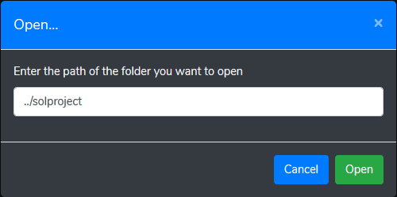
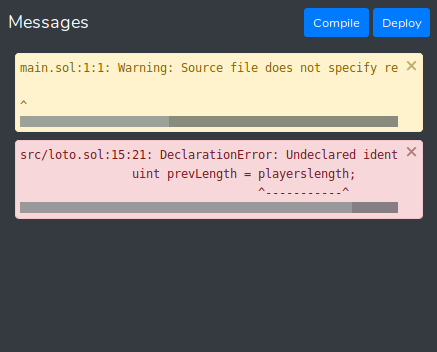

<h1 height="256">Solidity IDE</h1>

> A simple alternative to Remix IDE, working with Vue.js and Ganache


Solidity IDE is a light solution aimed at making Solidity development easier and more accessible, allowing you to concentrate only on your code by doing the Web3 part for you so you don't have to write anything else than Solidity.  

This IDE is web-based but works with the file system. You can open and use any directory on your computer as your project's folder. Files will be saved and created on your disk, not in the browser's local storage.  

## Install

### From NPM

```
npm install -g solidity-ide
```
On windows, you may need to install the [build tools](https://github.com/felixrieseberg/windows-build-tools) using: `npm install --global windows-build-tools`.  

Then, run the IDE using:
```
solidity-ide
```

### Using a release

Download the latest [release](https://github.com/System-Glitch/Solidity-IDE/releases) and run the IDE using:
```
npm run ide
```

### Build from source

Clone the repository and run `npm install`. On windows, you may need to install the [build tools](https://github.com/felixrieseberg/windows-build-tools) using: `npm install --global windows-build-tools`. Then build for a local usage using:  

```
npm install
npm run build-local
npm run ide
```

The third command will run ganache and the solc server in the background, don't kill this process when using the IDE.  

---

`npm run ide` accepts a path as parameter for the default directory:
```
npm run ide -- --path=path/to/project
```

You can pass ganache-cli parameters as well:
```
npm run ide -- --path=path/to/project -a 20 # Generate 20 accounts on startup
```

If you don't want to run a new ganache in the background (for example to use your own), use:
```
npm run ide -- --noganache
```

If you get an error like "_Couldn't fetch..._" on startup, this is probably because the IDE opened before the server finished loading. Just click "_refresh_" and you should be good to go.

### Getting started

#### File management

To get started, I recommend creating a new folder for your project. Once done, run the ide by specifying the path of the folder you just created. You can also choose to open it through the GUI by clicking the "_Open..._" button at the top of the file browser. The IDE will remember the last opened directory if you proceed that way.

<p align="center"></p>

Only `.sol` files and directories are shown in the browser.  
The next step is to create a file using the file browser. You can create files inside subdirectories (missing directories will be created) by writing the path with `/` separators. If you omit the `.sol` at the end of the filename, the IDE will add it automatically. You can start coding!

#### Account management

At the top right of the screen is the accounts panel. This panel allows you to manage ganache account. You can select which account you're currently using. When sending a transaction or depolying a contract, the fees will be withdrawn from the selected account.

<p align="center"></p>

If the list is empty, this is probably because the IDE opened before the server finished loading. Just click "_refresh_".  

You can choose another Ganache host if you want, by clicking the "_Change Ganache host_" button.  

#### Compile, deploy and test

At the bottom right of the screen is the messages panel. This panel displays errors and warnings.

Clicking "_compile_" will save all changes. Pressing _CTRL+S_ has the same behavior.  
Clicking "_deploy_" will recompile everything and deploy all contracts in the currently open `.sol` file on the local ganache host.

<p align="center"></p>

A new panel will appear at the bottom of the screen. Each tab represents an instance of your contracts. You can test the contracts methods by clicking the action buttons.

Grey buttons are `pure`  or `view` functions.  
Cyan buttons are functions requiring a transaction. You can specifiy an amount to send to the contract using the inputs next to the button. The given amount will be **withdrawn from the selected account** in the accounts panel.  
When a functions requires parameters, an aditionnal input is available. Data is written using the **JSON format** and parameters are **comma-separated**. (Strings must be surrounded by quotes for example)

The result of the call will be displayed in the text area next to the action buttons.

<p align="center"></p>

**You can find the ABI and bytecode (JSON format) in the `build` folder**, which is generated when you compile.

## For contributors

If you want to contribute to this project, fork, install the dependencies and run the development tools. On windows, you may need to install the [build tools](https://github.com/felixrieseberg/windows-build-tools) using: `npm install --global windows-build-tools`  

```
npm install

# Run solc server and ganache
npm run server
# Or npm run server -- --path=path/to/project
# Also accepts ganache-cli parameters

# Run vue.js server
npm run serve
```
